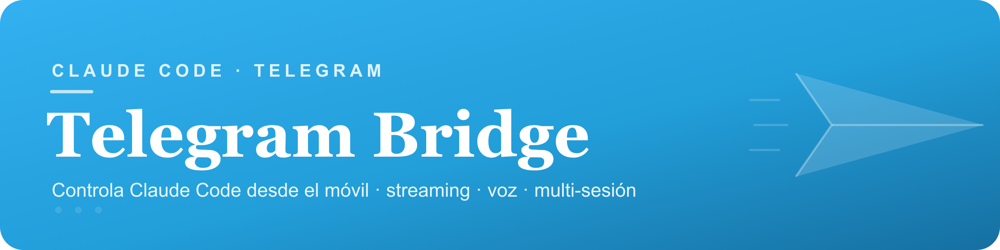

<div align="center">



<br>


**Controla Claude Code desde Telegram** — sesiones múltiples, respuestas en streaming, notas de voz y control total del agente desde el móvil.

</div>

---

> [!NOTE]
> Herramienta interna. La configuración y los secretos viven en `.env` (a partir de `.env.example`) y **nunca** se suben al repo.

## ✨ Qué hace

- 💬 **Habla con Claude Code desde Telegram** — escribes al bot y ejecuta tareas en tus proyectos locales.
- 📡 **Streaming en vivo** — la respuesta se va editando en el mismo mensaje según Claude trabaja.
- 🎙️ **Notas de voz → texto** — transcribe audios con OpenAI Whisper y los usa como prompt.
- 🧵 **Multi-sesión** — varias conversaciones con nombre en paralelo, cada una en su proyecto.
- 📂 **Cambio de proyecto** — salta entre carpetas de `~/Sites` sin salir del chat.
- 🔒 **Allowlist** — solo responden los IDs de Telegram autorizados.
- 💸 **Límites por tarea** — presupuesto (USD), turnos máximos y timeout configurables.
- 🚀 **Auto-arranque** — se instala como servicio `launchd` en macOS.

## 🧩 Requisitos

- Python 3 · un **bot de Telegram** (token de [@BotFather](https://t.me/BotFather)) · **Claude Code** CLI instalado
- (Opcional) clave de OpenAI para la transcripción de voz

## 🚀 Instalación

```bash
./install.sh
```

Crea el entorno virtual, copia `.env.example` → `.env` (edítalo) e instala el servicio `launchd` para que arranque solo.

## ⚙️ Configuración (`.env`)

| Variable | Descripción |
|----------|-------------|
| `TELEGRAM_BOT_TOKEN` | Token del bot (BotFather) |
| `ALLOWED_USER_IDS` | IDs de Telegram autorizados (separados por coma) |
| `SITES_DIR` / `DEFAULT_CWD` | Carpeta base de proyectos (por defecto `~/Sites`) |
| `DEFAULT_MODEL` | Modelo por defecto (`sonnet`, `opus`, …) |
| `DEFAULT_BUDGET_USD` | Presupuesto por tarea (USD) |
| `DEFAULT_MAX_TURNS` | Turnos máximos por tarea |
| `TASK_TIMEOUT_SECONDS` | Timeout por tarea (s) |
| `SESSION_IDLE_TIMEOUT` | Caducidad de sesión inactiva (s) |
| `CLAUDE_BIN` | Ruta al binario de Claude Code |
| `OPENAI_API_KEY` · `OPENAI_STT_MODEL` | Transcripción de voz (Whisper) |
| `RATE_LIMIT_PER_MIN` · `RATE_LIMIT_PER_HOUR` | Límites de uso |

> Tu ID de Telegram lo obtienes escribiendo `/id` al bot.

## ⌨️ Comandos del bot

| Comando | Acción |
|---------|--------|
| `/status` | Sesiones activas + ajustes actuales |
| `/sessions` | Explorar sesiones vivas + historial reciente |
| `/spawn <nombre> [ruta]` | Crear una sesión con nombre |
| `/switch [nombre]` | Cambiar de sesión activa |
| `/kill [nombre]` | Terminar una sesión |
| `/stop` | Parar la tarea en curso |
| `/new` | Limpiar el contexto de la sesión activa |
| `/continue <mensaje>` | Retomar la última sesión |
| `/context` | Auto-continuar on/off |
| `/projects` · `/cwd` | Cambiar / ver el directorio de trabajo |
| `/model` | Cambiar el modelo de Claude |
| `/budget` · `/turns` | Ver/ajustar presupuesto y turnos |
| `/cost` | Resumen de coste diario |
| `/id` | Tu ID de Telegram |
| `/help` | Ayuda |

<div align="center">
<br>
<sub>HobbyExpert · herramienta interna — configura tu <code>.env</code>, nunca lo subas al repo</sub>
</div>
